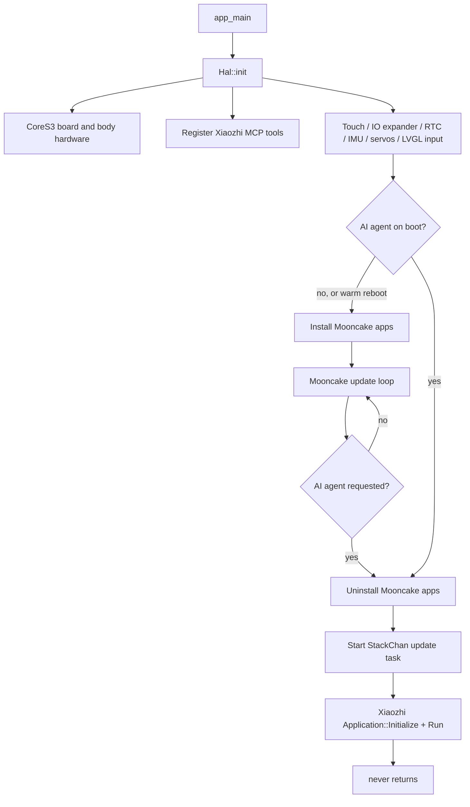

# StackChan codemap

This map is biased toward code that runs on the StackChan's ESP32-S3. It also shows the adjacent mobile app, backend, and separate ESP-NOW remote firmware where they cross the device boundary.

## Start here

The main device firmware is an [ESP-IDF 5.5.4 project](firmware/README.md) for the ESP32-S3-based M5Stack CoreS3. Its local code has three layers:

```text
Mooncake apps and LVGL views       firmware/main/apps/
                 |
                 v
StackChan behavior model          firmware/main/stackchan/
  avatar + motion + LEDs + modifiers + JSON/keyframes
                 |
                 v
Hardware/service abstraction      firmware/main/hal/
  CoreS3 board + body peripherals + network protocols
                 |
                 v
ESP-IDF + fetched Xiaozhi runtime  firmware/xiaozhi-esp32/
                                  firmware/components/
```

The two principal singletons are:

- [`GetHAL()`](firmware/main/hal/hal.h): hardware, persistence, network services, and cross-task signals.
- [`GetStackChan()`](firmware/main/stackchan/stackchan.h): the robot's current avatar, two-axis motion, two neon-light groups, and behavior modifiers.

For a first reading, follow:

1. [`firmware/main/main.cpp`](firmware/main/main.cpp) — boot and top-level runtime switch.
2. [`firmware/main/hal/hal.cpp`](firmware/main/hal/hal.cpp) and [`hal.h`](firmware/main/hal/hal.h) — initialization and public device API.
3. [`firmware/main/stackchan/stackchan.h`](firmware/main/stackchan/stackchan.h) — robot state/update model.
4. [`firmware/main/apps/app_template/app_template.cpp`](firmware/main/apps/app_template/app_template.cpp) — smallest example of a local app.
5. [`firmware/main/hal/board/stackchan.cc`](firmware/main/hal/board/stackchan.cc) — physical CoreS3 board construction.

## Repository layout

| Path | Runs where | Responsibility |
| --- | --- | --- |
| [`firmware/`](firmware/) | StackChan ESP32-S3 | Main device firmware, build configuration, partitions, and tests. |
| [`remote/code/`](remote/code/) | StickC-Plus ESP32 | Separate joystick/IMU ESP-NOW controller firmware. |
| [`app/`](app/) | Android/iOS | Flutter companion app: provisioning, remote avatar/motion, camera/video, dance, account. |
| [`server/`](server/) | Backend | Go API/WebSocket server used by device and app. |
| [`remote/`](remote/) | Documentation/artifacts | Remote-controller source and packaged binary. |

## Boot and runtime flow



Important consequences:

- Mooncake's launcher/apps and Xiaozhi are not concurrent peer apps. Opening `AI.AGENT` tears down Mooncake and transfers control to Xiaozhi.
- Returning from services that initialize non-restartable ESP-IDF subsystems is handled with a warm reboot. The saved carousel index is restored by [`apps/app_launcher/view/view.cpp`](firmware/main/apps/app_launcher/view/view.cpp).
- In Mooncake mode, the active app calls `GetStackChan().update()` from its `onRunning()` loop. In Xiaozhi mode, `_stackchan_update_task` does so approximately every 20 ms.
- LVGL and StackChan updates share the display lock. Cross-task code should use `LvglLockGuard` before changing the avatar, motion state, or LVGL objects.

### Hardware initialization order

`Hal::init()` performs:

1. NVS initialization.
2. Xiaozhi `Board::GetInstance()`, which constructs the CoreS3 board.
3. MCP tool registration.
4. head-touch sensor.
5. body IO expander, servo power, and 12 RGB LEDs.
6. RTC/timezone.
7. BMI270 IMU task.
8. two serial servos and the `Motion` object.
9. LVGL touch input device.

The board constructor in [`hal/board/stackchan.cc`](firmware/main/hal/board/stackchan.cc) initializes shared I2C, AXP2101 power, power saving, AW9523, SPI LCD, camera, FT6336 touch, and backlight.

## Main firmware modules

### App shell: `firmware/main/apps/`

Apps derive from Mooncake `AppAbility` and generally implement `onCreate`, `onOpen`, `onRunning`, and `onClose`.

| App | Main file | Role |
| --- | --- | --- |
| Launcher | [`app_launcher.cpp`](firmware/main/apps/app_launcher/app_launcher.cpp) | First-run setup, carousel, 30-second screensaver, app navigation. |
| AI agent | [`app_ai_agent.cpp`](firmware/main/apps/app_ai_agent/app_ai_agent.cpp) | Requests the one-way runtime transition to Xiaozhi. |
| Avatar | [`app_avatar.cpp`](firmware/main/apps/app_avatar/app_avatar.cpp) | WebSocket remote avatar/motion, camera/video calls, text, and dance playback. |
| ESP-NOW | [`app_espnow_ctrl.cpp`](firmware/main/apps/app_espnow_ctrl/app_espnow_ctrl.cpp) | Receiver or sender for the 8-byte head-pose/laser protocol. |
| App center | [`app_app_center.cpp`](firmware/main/apps/app_app_center/app_app_center.cpp) | Fetches installable firmware and launches an OTA-style app image. |
| EzData | [`app_ezdata.cpp`](firmware/main/apps/app_ezdata/app_ezdata.cpp) | MQTT-backed pairing and remote control service. |
| Dance | [`app_dance.cpp`](firmware/main/apps/app_dance/app_dance.cpp) | BLE avatar, motion, and RGB JSON control. |
| Setup | [`app_setup.cpp`](firmware/main/apps/app_setup/app_setup.cpp) | Account, AI, audio, connectivity, display, servo, startup, and system settings workers. |
| Template | [`app_template.cpp`](firmware/main/apps/app_template/app_template.cpp) | Minimal app example; not installed by `app_main`. |

Common persistent UI components live under [`apps/common/`](firmware/main/apps/common/): home indicator, status bar, reminders, loading page, and toast manager.

To add a local app:

1. Copy the structure of `app_template` and keep all app-owned UI/resources inside its lifecycle.
2. Include its header from [`apps/apps.h`](firmware/main/apps/apps.h).
3. Install it in [`main.cpp`](firmware/main/main.cpp).
4. Add its icon to [`assets/assets_bin/`](firmware/main/assets/assets_bin/) and load it with `assets::get_image()` if it appears in the launcher.
5. If the app starts a subsystem that cannot be cleanly stopped, follow the existing warm-reboot pattern and assign the correct launcher carousel index.

### Robot model: `firmware/main/stackchan/`

[`StackChan`](firmware/main/stackchan/stackchan.h) is a small coordinator rather than a hardware driver:

- [`avatar/`](firmware/main/stackchan/avatar/) owns LVGL face elements, emotions, speech bubbles, default skin, and decorators.
- [`motion/`](firmware/main/stackchan/motion/) owns yaw/pitch abstractions, spring/speed animation, normalized look coordinates, and 3D look-at math.
- [`addons/neon_light/`](firmware/main/stackchan/addons/neon_light/) maps the left/right logical light groups to the 12 body LEDs.
- [`modifiers/`](firmware/main/stackchan/modifiers/) contains composable per-update behaviors: blink, breath, dance, head pet, idle expression/motion, IMU reaction, speaking, and timed emotion/speech.
- [`animation/`](firmware/main/stackchan/animation/) applies timed keyframes across face features, servos, and both LED groups.
- [`json/`](firmware/main/stackchan/json/) parses external avatar, motion, RGB, and dance commands.

`StackChan::update()` runs modifiers first, removes self-destroyed modifiers, then updates avatar, motion, and both light groups. This is the preferred extension seam for reusable behavior: add a `Modifier`, attach it from an app or Xiaozhi display state, and avoid embedding behavior in a transport handler.

Motion units are tenths of a degree:

- yaw: `-1280..1280` (−128°..128°).
- pitch: `30..870` (3°..87°) in the physical servo configuration, though some protocol comments describe `0..900`.
- speed: `0..1000`; it is mapped to spring parameters by `Servo`.

Host-testable coordinate math is isolated in [`motion_math.cpp`](firmware/main/stackchan/motion/motion_math.cpp).

### HAL and services: `firmware/main/hal/`

The public surface is centralized in [`hal.h`](firmware/main/hal/hal.h); implementations are split by responsibility:

| File | Responsibility |
| --- | --- |
| [`hal.cpp`](firmware/main/hal/hal.cpp) | Init, system utilities, display lock/input, Xiaozhi transition, battery, warm reboot. |
| [`board/stackchan.cc`](firmware/main/hal/board/stackchan.cc) | CoreS3 Board implementation: PMIC, I2C, display, touch, camera, power saving. |
| [`board/hal_bridge.cc`](firmware/main/hal/board/hal_bridge.cc) | Adapter between local HAL/StackChan code and fetched Xiaozhi `Board`, `Display`, `Application`, and `Settings`. |
| [`board/stackchan_display.cc`](firmware/main/hal/board/stackchan_display.cc) | Xiaozhi-to-avatar adapter: status, emotion, speech, preview images, idle/speaking modifiers. |
| [`hal_servo.cpp`](firmware/main/hal/hal_servo.cpp) | SCS bus driver adapter, calibration, limits, torque/mode, stall protection. |
| [`hal_io_expander.cpp`](firmware/main/hal/hal_io_expander.cpp) | Body power and 12 RGB LEDs through PY32. |
| [`hal_head_touch.cpp`](firmware/main/hal/hal_head_touch.cpp) | Three-zone touch polling and press/release/swipe gestures. |
| [`hal_imu.cpp`](firmware/main/hal/hal_imu.cpp) | BMI270 polling and shake event. |
| [`hal_rtc.cpp`](firmware/main/hal/hal_rtc.cpp) | PCF8563, UTC RTC synchronization, POSIX timezone persistence. |
| [`audio.cpp`](firmware/main/hal/audio.cpp) | Microphone record/playback diagnostic and waveform frames. |
| [`hal_ble.cpp`](firmware/main/hal/hal_ble.cpp) | Dance control plus mobile-app Wi-Fi provisioning GATT servers. |
| [`hal_espnow.cpp`](firmware/main/hal/hal_espnow.cpp) | Fixed-channel ESP-NOW transport and laser GPIO. |
| [`hal_network.cpp`](firmware/main/hal/hal_network.cpp) | Wi-Fi connection, SNTP, signal status. |
| [`hal_ws_avatar.cpp`](firmware/main/hal/hal_ws_avatar.cpp) | Authenticated device WebSocket, camera/JPEG, remote avatar/motion/call protocol. |
| [`hal_ezdata.cpp`](firmware/main/hal/hal_ezdata.cpp) | EzData MQTT pairing and command loop. |
| [`hal_mcp.cpp`](firmware/main/hal/hal_mcp.cpp) | Tools callable by the Xiaozhi AI agent. |
| [`hal_account.cpp`](firmware/main/hal/hal_account.cpp) | Device account lookup/update/unbind HTTP calls. |
| [`hal_app_center.cpp`](firmware/main/hal/hal_app_center.cpp) | App catalog and firmware image download/launch. |
| [`hal_ota.cpp`](firmware/main/hal/hal_ota.cpp) | Main firmware OTA; boot validation is confirmed after 20 stable seconds in `hal.cpp`. |

The HAL uses `uitk::Signal` for task/transport boundaries. Consumers subscribe to events such as `onHeadPetGesture`, `onImuMotionEvent`, `onBle*Data`, `onEspNowData`, and `onWs*`; transport code should emit data, while an app or modifier decides behavior.

## Hardware ownership and pins

The authoritative CoreS3 pin constants are in [`hal/board/config.h`](firmware/main/hal/board/config.h).

| Hardware | Connection / owner | Notes |
| --- | --- | --- |
| Shared I2C bus 1 | SDA GPIO 12, SCL GPIO 11 | PMIC `0x34`, AW9523 `0x58`, FT6336 `0x38`, BMI270 `0x69`, PCF8563, SI12T, PY32 `0x6F`, audio codecs. |
| LCD | SPI3: MOSI 37, SCLK 36, CS 3, DC 35 | ILI9342/ILI9341 driver, 320×240 RGB565, 40 MHz. |
| Camera | D0..D7: 39,40,41,42,15,16,48,47; VSYNC 46, HREF 38, PCLK 45 | GC0308, 320×240 YUV422; XCLK is external. |
| Audio | I2S MCLK 0, WS 33, BCLK 34, DIN 14, DOUT 13 | ES7210 input and AW88298 output through `CoreS3AudioCodec`. |
| Servos | UART1 RX 6 / TX 7 at 1 Mbaud | yaw ID 1; pitch ID 2. Zero positions are stored in NVS namespace `servo`. |
| Servo power | PY32 pin 0 | Enabled during HAL init. |
| RGB LEDs | PY32 LED interface on pin 13 | 12 LEDs; logical left/right grouping is in `NeonLight`. |
| Laser output | GPIO 2 | Controlled only by ESP-NOW app code; defaults off. |
| Display touch | FT6336 polling every 20 ms | Bridged into an LVGL pointer input. |
| Head touch | SI12T task every 50 ms | Emits press, release, forward swipe, backward swipe. |
| IMU | BMI270 task every 100 ms | Shake threshold is `16.0`; pickup detection is present but disabled. |

Treat servo limits as safety boundaries. Do not bypass the clamping/calibration path in `ScsServo`, and preserve the pitch stall protection.

## External control protocols

### JSON command model

[`stackchan/json/json_helper.cpp`](firmware/main/stackchan/json/json_helper.cpp) accepts partial updates:

```json
{"yawServo":{"angle":300,"speed":500},"pitchServo":{"angle":200}}
```

- avatar keys: `leftEye`, `rightEye`, `mouth`; feature keys: `x`, `y`, `rotation`, `weight`, `size`.
- motion keys: `yawServo`, `pitchServo`; each supports `rotate`, or `angle` with optional `speed` or `spring.{stiffness,damping}`.
- light keys: `leftRgbColor`, `rightRgbColor`, and matching `*Duration` values.
- dance data is an array of keyframes combining those face/servo/light fields plus `durationMs`.

### ESP-NOW

The device app and remote exchange a little-endian 8-byte packet:

```text
byte 0      target ID; 0 broadcasts
bytes 1..2  int16 yaw, tenths of a degree
bytes 3..4  int16 pitch, tenths of a degree
bytes 5..6  int16 speed, 0..1000
byte 7      laser enabled
```

Both endpoints must use the same Wi-Fi channel. The device implementation is [`app_espnow_ctrl.cpp`](firmware/main/apps/app_espnow_ctrl/app_espnow_ctrl.cpp); the handheld sender is [`remote/code/main/joystick/joystick_handle.c`](remote/code/main/joystick/joystick_handle.c).

### Avatar WebSocket

[`hal_ws_avatar.cpp`](firmware/main/hal/hal_ws_avatar.cpp) connects to `/stackChan/ws?deviceType=StackChan` with an authorization header. Binary frames use `[type:1][length:4][payload]`. Types cover JPEG, avatar/motion JSON, camera start/stop, call control, device name, heartbeat, text, video mode, dance sequences, and reserved audio streaming. This service is consumed by `AppAvatar` and corresponds to backend code in [`server/internal/web_socket/`](server/internal/web_socket/) and Flutter code in [`app/lib/network/web_socket_util.dart`](app/lib/network/web_socket_util.dart).

### BLE and EzData

- BLE has one server for avatar/motion/RGB JSON and another for companion-app provisioning. Start with [`hal_ble.cpp`](firmware/main/hal/hal_ble.cpp) and trace emitted `onBle*` or `onAppConfigEvent` signals.
- EzData starts Wi-Fi, obtains a pairing code over HTTP, then uses MQTT for commands. Start with [`hal_ezdata.cpp`](firmware/main/hal/hal_ezdata.cpp).

### Xiaozhi MCP tools

[`hal_mcp.cpp`](firmware/main/hal/hal_mcp.cpp) currently registers:

- `self.robot.get_head_angles`
- `self.robot.set_head_angles`
- `self.robot.set_led_color`
- `self.robot.create_reminder`
- `self.robot.get_reminders`
- `self.robot.stop_reminder`

Add new AI-controlled device capabilities here, but put reusable hardware access in `Hal` and reusable behavior in `StackChan`/a modifier first.

## Build, generated inputs, and persistence

The main firmware requires ESP-IDF 5.5.4 with the ESP32-S3 toolchain. The local toolchains are stored outside the checkout at `../.toolchains/` relative to the repository root. In particular, ESP-IDF is at `../.toolchains/esp-idf-v5.5.4/`, and its downloaded compilers, Python environment, CMake, and Ninja are under `../.toolchains/espressif/`. Do not conclude that ESP-IDF is unavailable merely because `idf.py` is absent from the initial `PATH`.

Activate it from the repository root using the script appropriate for the current shell:

```fish
set -gx IDF_TOOLS_PATH ../.toolchains/espressif
source ../.toolchains/esp-idf-v5.5.4/export.fish
```

```sh
export IDF_TOOLS_PATH=../.toolchains/espressif
. ../.toolchains/esp-idf-v5.5.4/export.sh
```

Setting `IDF_TOOLS_PATH` is required; otherwise the export script looks under `~/.espressif`. When already inside `firmware/`, use `../../.toolchains/...` instead. After activation, run from [`firmware/`](firmware/):

```sh
uv run python fetch_repos.py
idf.py build
idf.py flash
```

`fetch_repos.py` checks out pinned Mooncake, Mooncake Log, Smooth UI Toolkit, Xiaozhi ESP32, ArduinoJson, and Espressif ESP-NOW sources. These directories are not present in a fresh checkout until fetched. It also applies [`patches/xiaozhi-esp32.patch`](firmware/patches/xiaozhi-esp32.patch), so changes to fetched Xiaozhi behavior should normally be represented in that patch rather than left only in the fetched working tree.

ESP-IDF Component Manager dependencies and the minimum IDF constraint are in [`main/idf_component.yml`](firmware/main/idf_component.yml); exact resolved versions are held in [`dependencies.lock`](firmware/dependencies.lock). The verified build resolves 60 lock entries: ESP-IDF itself plus 59 managed component packages. Keep the lockfile unchanged for reproducible builds unless a dependency update is intentional.

The build proceeds in four broad stages:

1. CMake selects `esp32s3` from `sdkconfig.defaults` and assembles local firmware, fetched sources, and managed components.
2. Component Manager populates `managed_components/` from `dependencies.lock`.
3. CMake generates language/audio inputs and `generated_assets.bin`, then Ninja compiles and links the firmware.
4. `esptool.py` converts the ELF into the flashable `build/stack-chan.bin` image and validates it against the partition table.

[`main/CMakeLists.txt`](firmware/main/CMakeLists.txt) combines local sources with selected Xiaozhi sources, generated language data, sound files, fonts, wake-word models, and the assets image. A verified ESP-IDF 5.5.4 build completed all 2,491 Ninja actions and produced:

| Output | Flash offset | Verified size / role |
| --- | ---: | --- |
| `build/bootloader/bootloader.bin` | `0x0` | Second-stage bootloader. |
| `build/partition_table/partition-table.bin` | `0x8000` | Partition layout. |
| `build/ota_data_initial.bin` | `0xD000` | Initial OTA selection data. |
| `build/stack-chan.bin` | `0x20000` | `0x39C4E0` bytes; 27% remains in the smallest app slot. |
| `build/generated_assets.bin` | `0xA00000` | Approximately 2.2 MB; flashed to the assets partition. |

`idf.py flash` uses this generated flash map. `idf.py flash monitor` flashes and immediately opens the serial monitor for device verification.

Configuration lives in:

- [`sdkconfig.defaults`](firmware/sdkconfig.defaults): ESP32-S3, 16 MB QIO flash, 8 MB PSRAM use, English, StackChan board, BLE, camera, LVGL, and wake-word defaults.
- [`main/Kconfig.projbuild`](firmware/main/Kconfig.projbuild): server URL, OTA URL, language, board, assets, audio, BLE, Wi-Fi provisioning, and upstream Xiaozhi options.
- `sdkconfig.defaults.local`: optional local deployment overlay auto-loaded by the top-level CMake file. It is the intended place for `CONFIG_STACKCHAN_SERVER_URL`, `CONFIG_OTA_URL`, and other local overrides. The file is not currently listed in the repository's `.gitignore`, so take care not to commit deployment secrets.

[`partitions.csv`](firmware/partitions.csv) allocates NVS, OTA metadata, two 0x4f0000 app slots, a 4 MB `assets` SPIFFS partition at `0xA00000`, and coredumps.

Persistent settings use Xiaozhi's `Settings` wrapper over NVS. Common namespaces include `servo`, `display`, `audio`, `system`, `xiaozhi`, `stackchan`, and `warm_boot`. Factory reset erases all NVS.

## Tests and verification

The only host-side regression suite currently covers normalized and 3D motion coordinate math:

```sh
cmake -S tests -B build-host-tests
cmake --build build-host-tests
ctest --test-dir build-host-tests --output-on-failure
```

Source: [`firmware/tests/motion_math_test.cpp`](firmware/tests/motion_math_test.cpp).

For hardware-facing changes, the practical end-to-end loop is:

1. run host tests for extracted pure logic.
2. `idf.py build` and inspect size/partition output.
3. `idf.py flash monitor` on the device.
4. exercise the affected app plus the transition back to the launcher.
5. for motion changes, test near neutral first and verify both calibration and torque release before trying limits.

## Separate remote-controller firmware

[`remote/code/`](remote/code/) is a second ESP-IDF project for an original ESP32 StickC-Plus with a Hat Mini JoyC, not part of the ESP32-S3 device image. Its entry point is [`StackChan-RemoteControl-ESPNow.cpp`](remote/code/main/StackChan-RemoteControl-ESPNow.cpp); it creates setup, joystick, and IMU tasks and broadcasts the 8-byte protocol above.

It targets ESP-IDF 5.4.2 according to [`remote/code/README.md`](remote/code/README.md), uses M5Unified, ESP-NOW, I2C Bus, and LVGL 8, and has a documented M5GFX compatibility edit before building. Keep its toolchain/configuration separate from `firmware/`, which uses LVGL 9 and ESP-IDF 5.5.4.

## Change-location guide

| Goal | Start here |
| --- | --- |
| Add a screen/local capability | `apps/app_template`, then `apps.h` and `main.cpp`. |
| Add a reusable expression or motion behavior | `stackchan/modifiers/`; attach it from the owning app/state. |
| Change face drawing or emotions | `stackchan/avatar/`; Xiaozhi string mapping is in `hal/board/stackchan_display.cc`. |
| Change servo behavior or limits | `stackchan/motion/` for generic logic; `hal/hal_servo.cpp` for physical SCS behavior/config. |
| Add a sensor/body peripheral | driver under `hal/drivers/`, lifecycle/API in a focused `hal_*.cpp`, public method/signal in `hal.h`. |
| Make a capability callable by the AI agent | reusable HAL/behavior first, then register an MCP tool in `hal_mcp.cpp`. |
| Add mobile remote commands | protocol in `hal_ws_avatar.cpp` or `hal_ble.cpp`, app consumer under `apps/`, matching Flutter/backend changes. |
| Add an offline controller command | `app_espnow_ctrl.cpp` plus `remote/code/`; version the packet deliberately if its size changes. |
| Change server endpoints | `Kconfig.projbuild`, `hal/utils/secret_logic/`, the relevant `hal_*` client, then `server/`. |
| Change firmware/app OTA | `hal_ota.cpp`, `hal_app_center.cpp`, partition table, and server app catalog. |
| Change Xiaozhi internals | pinned ref in `repos.json` and `patches/xiaozhi-esp32.patch`; avoid unrecorded edits in fetched sources. |

## Known architectural edges

- The firmware has several long-lived FreeRTOS tasks and global/static service objects. Many services are designed to start once, which explains the warm-reboot exits.
- App signal connections are often cleared wholesale in `onClose()` rather than tracked per connection. Check ownership before adding another subscriber to the same HAL signal.
- JSON control accepts partial data but does little schema/range validation itself; the servo layer provides the final physical clamp.
- The full firmware cannot configure/build before `fetch_repos.py` has populated its pinned external source trees.
- The remote firmware's documented M5GFX source edit is manual and therefore easy to lose on dependency refresh.
- Tests cover pure motion math only; protocol parsing, modifiers, and state transitions currently depend on device testing.
